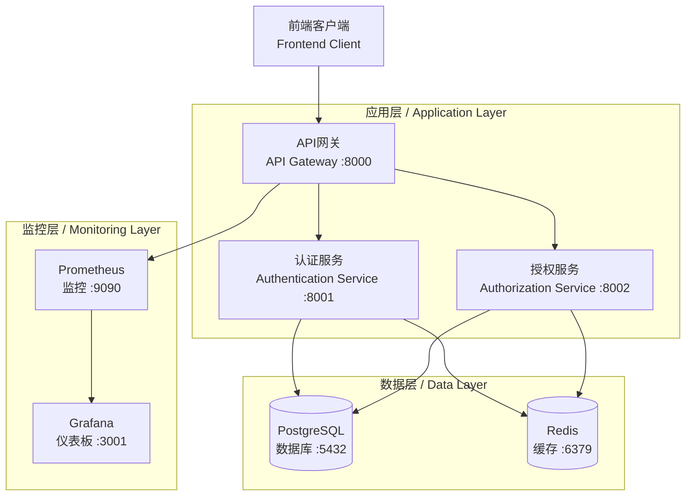

# 独立IAM认证授权服务

**Independent IAM Authentication & Authorization Service**

[](https://github.com/your-org/reusable-iam-auth-service)
[](LICENSE)
[](https://github.com/your-org/reusable-iam-auth-service/actions)
[](https://hub.docker.com/r/your-org/iam-service)

## 项目概述 / Project Overview

这是一个**完全独立**的IAM（身份认证与访问管理）服务，专门设计为可重用的微服务架构，可以轻松集成到任何项目中，提供企业级的认证和授权功能。

This is a **completely independent** IAM (Identity and Access Management) service designed as a reusable microservice architecture that can be easily integrated into any project, providing enterprise-grade authentication and authorization capabilities.

### ✨ 核心特性 / Core Features

🔐 **完整认证系统 / Complete Authentication System**
- JWT令牌认证 / JWT Token Authentication
- 会话管理 / Session Management  
- 密码策略 / Password Policies
- 多因子认证 (MFA) / Multi-Factor Authentication
- 社交登录集成 / Social Login Integration

🛡️ **强大授权引擎 / Powerful Authorization Engine**
- 基于角色的访问控制 (RBAC) / Role-Based Access Control
- 基于属性的访问控制 (ABAC) / Attribute-Based Access Control
- 细粒度权限管理 / Fine-grained Permission Management
- 动态策略引擎 / Dynamic Policy Engine
- 批量授权检查 / Batch Authorization Checks

🚀 **现代化架构 / Modern Architecture**
- 微服务架构 / Microservices Architecture
- 容器化部署 / Containerized Deployment
- 高可用设计 / High Availability Design
- 水平扩展 / Horizontal Scaling
- 云原生支持 / Cloud Native Support

📊 **完善监控 / Comprehensive Monitoring**
- Prometheus指标收集 / Prometheus Metrics
- Grafana仪表板 / Grafana Dashboards
- 健康检查 / Health Checks
- 审计日志 / Audit Logging
- 性能监控 / Performance Monitoring

🌐 **现代前端 / Modern Frontend**
- Vue 3 + TypeScript / Vue 3 + TypeScript
- 响应式设计 / Responsive Design
- 多语言支持 / Multi-language Support
- 现代UI组件 / Modern UI Components
- PWA支持 / PWA Support

## 🏗️ 系统架构 / System Architecture



### 服务架构详细说明 / Detailed Service Architecture

| 服务组件 / Component | 端口 / Port | 功能说明 / Description |
|---------------------|-------------|------------------------|
| **API网关** / API Gateway | 8000 | 统一入口，请求路由，负载均衡 / Unified entry, request routing, load balancing |
| **认证服务** / Authentication Service | 8001 | JWT令牌管理，用户认证，会话管理 / JWT token management, user authentication, session management |
| **授权服务** / Authorization Service | 8002 | RBAC/ABAC授权，策略引擎，权限检查 / RBAC/ABAC authorization, policy engine, permission checks |
| **前端应用** / Frontend App | 3000 | Vue3前端界面，用户交互 / Vue3 frontend interface, user interaction |
| **PostgreSQL** / PostgreSQL | 5432 | 主数据存储，用户数据，策略数据 / Primary data storage, user data, policy data |
| **Redis** / Redis | 6379 | 缓存，会话存储，临时数据 / Caching, session storage, temporary data |
| **Prometheus** / Prometheus | 9090 | 指标收集，性能监控 / Metrics collection, performance monitoring |
| **Grafana** / Grafana | 3001 | 可视化仪表板，监控展示 / Visualization dashboards, monitoring display |

### 项目结构 / Project Structure

```
reusable-iam-auth-service/
├── services/                     # 微服务 / Microservices
│   ├── authentication-service/   # 认证服务 / Authentication Service
│   ├── authorization-service/    # 授权服务 / Authorization Service
│   └── api-gateway/              # API网关 / API Gateway
├── frontend/                     # 前端应用 / Frontend Application
│   ├── src/                      # 源代码 / Source Code
│   ├── components/               # 可重用组件 / Reusable Components
│   └── views/                    # 页面视图 / Page Views
├── database/                     # 数据库 / Database
│   ├── schemas/                  # 数据库模式 / Database Schemas
│   └── seeds/                    # 种子数据 / Seed Data
├── shared/                       # 共享模块 / Shared Modules
├── config/                       # 配置文件 / Configuration Files
├── docker-compose.yml            # Docker编排文件 / Docker Compose File
├── Makefile                      # 管理命令 / Management Commands
└── README.md                     # 项目文档 / Project Documentation
```

## 🚀 快速开始 / Quick Start

### 环境要求 / Requirements

- **Docker** >= 20.10.0
- **Docker Compose** >= 2.0.0
- **Make** (可选，用于便捷命令 / Optional, for convenience commands)

### 1. 克隆项目 / Clone Repository

```bash
git clone https://github.com/your-org/reusable-iam-auth-service.git
cd reusable-iam-auth-service
```

### 2. 初始化环境 / Initialize Environment

```bash
# 使用Make命令（推荐）/ Using Make (Recommended)
make init

# 或手动复制环境文件 / Or manually copy environment file
cp .env.example .env
```

### 3. 配置环境变量 / Configure Environment Variables

编辑 `.env` 文件，设置你的配置：

```bash
# 数据库密码 / Database Password
POSTGRES_PASSWORD=your_secure_password

# JWT密钥 / JWT Secret Key
JWT_SECRET_KEY=your-super-secret-jwt-key

# Redis密码 / Redis Password  
REDIS_PASSWORD=your_redis_password

# 其他配置... / Other configurations...
```

### 4. 启动服务 / Start Services

```bash
# 使用Make命令启动所有服务 / Start all services using Make
make start

# 或使用Docker Compose直接启动 / Or start directly with Docker Compose
docker-compose up -d
```

### 5. 验证服务 / Verify Services

```bash
# 检查所有服务健康状态 / Check all services health
make health

# 或手动检查 / Or check manually
curl http://localhost:8000/gateway/health
```

### 6. 访问应用 / Access Application

服务启动后，你可以通过以下地址访问：

- **前端应用** / Frontend: http://localhost:3000
- **API文档** / API Documentation: http://localhost:8000/docs
- **监控仪表板** / Monitoring Dashboard: http://localhost:3001 (admin/grafana_admin_123)
- **指标监控** / Metrics: http://localhost:9090

## 📚 详细文档 / Detailed Documentation

### 🔐 认证服务 / Authentication Service

认证服务负责用户身份验证和JWT令牌管理。

#### API端点 / API Endpoints:

| 端点 / Endpoint | 方法 / Method | 描述 / Description |
|-----------------|---------------|-------------------|
| `/auth/login` | POST | 用户登录 / User login |
| `/auth/logout` | POST | 用户登出 / User logout |
| `/auth/refresh` | POST | 刷新令牌 / Refresh token |
| `/auth/validate` | GET | 验证令牌 / Validate token |
| `/users/me` | GET | 获取当前用户信息 / Get current user |
| `/users/me` | PUT | 更新用户信息 / Update user info |

#### 登录示例 / Login Example:

```bash
curl -X POST http://localhost:8000/api/v1/auth/login \
  -H "Content-Type: application/json" \
  -d '{
    "username": "admin",
    "password": "admin123"
  }'
```

### 🛡️ 授权服务 / Authorization Service

授权服务实现了强大的RBAC/ABAC授权模型。

#### API端点 / API Endpoints:

| 端点 / Endpoint | 方法 / Method | 描述 / Description |
|-----------------|---------------|-------------------|
| `/authorize` | POST | 单个授权检查 / Single authorization check |
| `/authorize/bulk` | POST | 批量授权检查 / Bulk authorization check |
| `/policies` | GET | 列出策略 / List policies |
| `/policies` | POST | 创建策略 / Create policy |
| `/audit/decisions` | GET | 查询审计日志 / Query audit log |

## 🔧 管理命令 / Management Commands

项目提供了便捷的Makefile命令：

```bash
# 初始化环境 / Initialize environment
make init

# 启动所有服务 / Start all services
make start

# 查看服务状态 / View service status
make ps

# 查看日志 / View logs
make logs

# 健康检查 / Health check
make health

# 停止服务 / Stop services
make stop

# 清理资源 / Clean resources
make clean
```

## 🎯 独立性保证 / Independence Guarantee

### ✅ 完全自包含 / Completely Self-contained
- 独立的数据库和模式 / Independent database and schemas
- 独立的配置管理 / Independent configuration management
- 独立的部署脚本 / Independent deployment scripts
- 独立的监控和日志 / Independent monitoring and logging

### ✅ 零外部依赖 / Zero External Dependencies
- 不依赖任何外部认证服务 / No dependency on external auth services
- 不依赖任何外部数据库 / No dependency on external databases
- 不依赖任何外部缓存 / No dependency on external cache services
- 不依赖任何外部配置中心 / No dependency on external configuration centers

### ✅ 标准化接口 / Standardized Interfaces
- 标准化的REST API / Standardized REST APIs
- OpenAPI文档支持 / OpenAPI documentation support
- 标准化的错误响应 / Standardized error responses
- 标准化的认证流程 / Standardized authentication flows

## 🚀 部署选项 / Deployment Options

### 1. Docker Compose (推荐 / Recommended)
```bash
docker-compose up -d
```

### 2. Kubernetes
```bash
kubectl apply -f k8s/
```

### 3. 单机部署 / Standalone Deployment
```bash
./scripts/deploy-standalone.sh
```

## 🔒 安全特性 / Security Features

- JWT令牌安全 / JWT Token Security
- HTTPS/TLS支持 / HTTPS/TLS Support
- 密码加密存储 / Encrypted Password Storage
- 会话管理 / Session Management
- 审计日志 / Audit Logging
- 防暴力破解 / Brute Force Protection
- CORS配置 / CORS Configuration
- 速率限制 / Rate Limiting

## 📊 监控和观测 / Monitoring & Observability

- Prometheus指标收集 / Prometheus Metrics Collection
- Grafana仪表板 / Grafana Dashboards
- 结构化日志 / Structured Logging
- 健康检查端点 / Health Check Endpoints
- 性能监控 / Performance Monitoring

## 🤝 贡献指南 / Contributing

我们欢迎社区贡献！请遵循以下步骤：

1. Fork项目 / Fork the project
2. 创建特性分支 / Create feature branch
3. 提交更改 / Commit changes
4. 推送分支 / Push branch
5. 创建Pull Request / Create Pull Request

## 📞 支持 / Support

- 📧 Email: support@your-domain.com
- 🐛 Issues: [GitHub Issues](https://github.com/your-org/reusable-iam-auth-service/issues)
- 💬 Discussions: [GitHub Discussions](https://github.com/your-org/reusable-iam-auth-service/discussions)

## 📄 许可证 / License

本项目采用MIT许可证 - 详见 [LICENSE](LICENSE) 文件。

This project is licensed under the MIT License - see the [LICENSE](LICENSE) file for details.

---

**独立IAM认证授权服务** - 为现代应用提供安全、可靠、可扩展的身份认证与访问管理解决方案。

**Independent IAM Authentication & Authorization Service** - Providing secure, reliable, and scalable identity and access management solutions for modern applications.